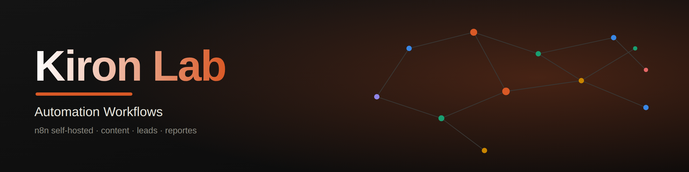

<div align="center">
  
  <br>
  <h1 style="font-size: 28px; letter-spacing: 4px; color: #2F6FED; font-weight: 500;">KIRON LAB</h1>
  <p style="font-size: 12px; letter-spacing: 3px; color: #64748B;">N8N AUTOMATION WORKFLOWS</p>
</div>

<br>

Versioned backup of the **Kiron Lab** n8n automation workflows and infrastructure — n8n self-hosted on Hetzner.

**n8n is the source of truth in production.** If you edit something directly in the n8n UI, remember to re-export the JSON and update it here so it does not drift out of sync.

## Structure

```
infra/          → docker-compose.yml and server deploy script (shared, single n8n)
workflows/
  content-curation/     → workflow type: discovers articles, filters with AI, generates
                           a bilingual draft, human review via Telegram
    engine/              → parameterized engine workflow (Execute Workflow)
    rob-linkedin/         → profile in production (LinkedIn)
    barmon/               → profile in production (Facebook)
```

The repo is organized **by workflow type first, profile second**. The same content-curation pattern is reused across profiles, so a bug or improvement in the pattern is fixed once and applies to every profile that uses it.

## Architecture: Engine + Caller + Approval

Instead of duplicating the whole workflow per profile, `content-curation` is split into three pieces:

| Piece | What it does | Duplicated per profile? |
|---|---|---|
| **Engine** | Shared heavy logic: read RSS sources, dedupe, DeepSeek editorial filter, ES/EN draft generation, Sheets logging, send for review | No — a single workflow, invoked via `Execute Workflow` |
| **Caller** | Profile's own Schedule Trigger + builds its config (prompts, channel, limit, sheet) → calls the Engine | Yes, but thin (few nodes) |
| **Approval** | Telegram Trigger tied to the profile's own bot → matches the row in Sheets → updates status | Yes — necessarily, each profile has its own bot/review chat |

The Engine (`engine/kiron-labs-content-curation-engine-v1.json`) is extracted as a single workflow invoked via `Execute Workflow`. Profiles like `rob-linkedin/` and `barmon/` build their Caller + Approval pieces on top of it, so adding a new profile is just those two thin pieces.

## Current workflows (`content-curation/rob-linkedin/`)

| File | n8n name | What it does | Schedule |
|---|---|---|---|
| `kiron-lab-rob-rss-sources-health-check-v1.json` | Kiron Labs - Rob - RSS Sources Health Check v1 | Weekly validation of every URL in the `RSS-Sources` tab, alerts via Telegram if any active source is broken | Monday 8:00 AM (CDMX) |
| `kiron-lab-rob-linkedin-content-curation-v1.json` | Kiron Labs - Rob - LinkedIn Content Curation v1 | Current version (pre-Engine, monolithic): finds articles, filters with DeepSeek, generates a bilingual ES/EN draft, sends it for Telegram review | Mon–Fri 10:00 AM (CDMX) |

## Current workflows (`content-curation/barmon/`)

| File | n8n name | What it does |
|---|---|---|
| `kiron-labs-barmon-facebook-content-v1.json` | Kiron Labs - BarMon - Facebook Content v1 | Caller: builds BarMon's config and posts content to Facebook via the shared Engine |
| `kiron-labs-barmon-telegram-approval-v1.json` | Kiron Labs - BarMon - Telegram Approval v1 | Approval: Telegram Trigger tied to BarMon's bot → updates review status |

### Daily topic rotation

| Day | Topic |
|---|---|
| Monday | AI applied to team leadership |
| Tuesday | Developer Experience and productivity |
| Wednesday | Process improvement (Planning, Sprint, PR Reviews, onboarding) |
| Thursday | Practical Engineering Management with measurable results |
| Friday | Technology applied to real life in a light and pleasant way to close the work week |

## Infrastructure

- **Server:** Hetzner Cloud CX23, Ubuntu 24.04, `128.140.12.184`
- **Domain:** `n8n.kironlab.com` (Cloudflare DNS, HTTPS via Caddy)
- **n8n:** Docker, launched with `docker compose` (see `infra/docker-compose.yml` and `infra/deploy-n8n.sh`)

### Service redeploy

On the server, inside `~/n8n/`:

```bash
./deploy-n8n.sh
```

Stops the container if it exists, brings it up with `docker compose up -d`, and shows the status. The `n8n_data` volume (workflows, credentials, executions) is persistent and external — never deleted on redeploy.

### Relevant environment variables

Defined in `infra/docker-compose.yml`. None are secret except if you decide to rotate the Telegram `chat_id`. The real credentials (Google Sheets OAuth2, DeepSeek API key, Telegram Bot Token) **live inside n8n** (in the `n8n_data` volume), never in this repo nor in container environment variables.

## Required credentials in n8n (not in this repo)

- `Google Sheets - Rob` — OAuth2
- `DeepSeek API - Rob` — Header Auth (`Authorization: Bearer sk-...`)
- `Telegram - Rob` — Bot Token (bot: **Kiron Labs**)

Each new profile brings its own set: its own Telegram bot, and if applicable its own Instagram/Facebook credentials.

## Naming convention

- Workflows: `Kiron Labs - [Profile] - [Function] v[N]`
- Credentials in n8n: `[Service] - [Profile]`
- Files in this repo: kebab-case of the n8n workflow name

## How to update a workflow

1. Edit in the n8n UI.
2. Export: **⋯ → Download** (or Import/Export from the workflow menu).
3. Replace the corresponding file in `workflows/`.
4. Commit with a descriptive message (e.g. `fix: correct non-ancestor node reference in Code - Topic of the Day`).

## Technical journal

The detailed history of infrastructure decisions, bugs found/fixed and editorial criteria changes lives in the Claude project "N8N Workflows" (`Diario Tecnico - N8N Automation.md`), not in this repo.

## License

MIT — see [LICENSE](LICENSE).
